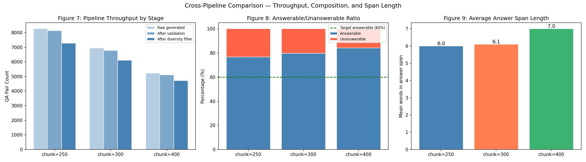
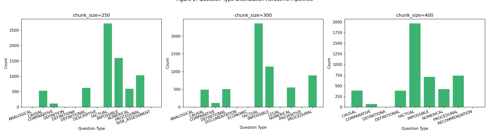

# ClinicalBERT Pressure Injury QA

Extractive question answering over pressure ulcer / pressure injury clinical guidelines, in SQuAD v2 format (answerable **and** unanswerable questions).

The project has four parts:
- **Dataset.** 13 public guideline documents (81,657 words) are turned into three SQuAD v2 datasets with a local LLM (`gemma3:12b` via Ollama). Each dataset uses a different chunk size: 250, 300 or 400 words. The final sizes are 7,280, 6,105 and 4,718 QA pairs.
- **Training.** `bert-base-uncased` and `emilyalsentzer/Bio_ClinicalBERT` are fine-tuned on each dataset, giving six models.
- **Evaluation.** The models are evaluated with lexical, semantic and LLM-as-judge metrics.
- **RAG.** Direct (oracle-context) QA is compared with a retrieval-augmented pipeline.

**Headline results:**
- **Training:** ClinicalBERT trained on 300-word chunks had the lowest validation loss (**1.2949**, versus 1.3751 for BERT-base on the same data).
- **Test set:** the same model had the highest BERTScore F1 on the answers it returned (**0.9285**) and the fewest spans returned for unanswerable questions (**7/142 = 4.9%**).
- **RAG:** retrieval raised ClinicalBERT-300's BERTScore F1 from **0.6355 to 0.7189** on 150 answerable test questions. Token F1 and Exact Match fell.

> ⚠️ Research and coursework project (7146COMP Advanced Topics in Deep Learning). The QA pairs are machine-generated and have not been reviewed by a clinician. This is **not** a medical device and must not be used for clinical decisions.

<p align="center">
  
</p>

---

## Contents

- [Results](#results)
- [Dataset](#dataset)
- [Pipeline overview](#pipeline-overview)
- [Repository structure](#repository-structure)
- [Setup](#setup)
- [How to run](#how-to-run)
- [Known issues and limitations](#known-issues-and-limitations)
- [References](#references)

---

## Results

All numbers below are copied from printed cell outputs in the notebooks.

### 1. Dataset construction (`dataset_construction3.ipynb`)

| | chunk = 250 | chunk = 300 | chunk = 400 |
|---|---:|---:|---:|
| Overlap (words) | 50 | 60 | 80 |
| Chunks (mean words) | 407 (248.7) | 342 (296.2) | 256 (394.8) |
| QA generation time | 4:09:21 | 3:30:56 | 2:44:34 |
| Raw generated QA pairs | 8,258 | 6,936 | 5,218 |
| Span valid on first pass | 2,043 | 1,471 | 878 |
| Span repaired | 6,088 | 5,297 | 4,226 |
| Rejected (answer not in context) | 127 | 168 | 114 |
| Near-duplicates rephrased and kept | 1,355 | 1,080 | 773 |
| Near-duplicates discarded | 851 | 663 | 386 |
| **Final QA pairs** | **7,280** | **6,105** | **4,718** |
| Answerable / unanswerable | 5,582 / 1,698 (76.7%) | 4,868 / 1,237 (79.7%) | 3,967 / 751 (84.1%) |
| Train / val / test | 5,839 / 717 / 724 | 4,869 / 618 / 618 | 3,740 / 497 / 481 |
| Avg answer / question length (words) | 6.0 / 11.3 | 6.1 / 11.4 | 7.0 / 11.4 |

All three SQuAD v2 files passed the span-integrity check: `context[answer_start:answer_start+len(text)] == text`.

### 2. Fine-tuning (`model_training.ipynb`)

All six runs used identical hyperparameters and ran the full 4 epochs; early stopping did not trigger.

| Base model | Chunk | Train features | Val features | Train loss | Best val loss | Train time (s) |
|---|:-:|---:|---:|---:|---:|---:|
| bert-base-uncased | 250 | 8,128 | 957 | 1.5185 | 1.7493 | 270.5 |
| bert-base-uncased | 300 | 9,579 | 1,234 | 1.2780 | 1.3751 | 321.0 |
| bert-base-uncased | 400 | 8,750 | 1,179 | 1.3510 | 1.4129 | 295.0 |
| Bio_ClinicalBERT | 250 | 8,594 | 1,031 | 1.3629 | 1.5801 | 284.8 |
| Bio_ClinicalBERT | 300 | 10,081 | 1,305 | 1.1919 | **1.2949** | 336.6 |
| Bio_ClinicalBERT | 400 | 9,077 | 1,216 | 1.2153 | 1.3422 | 307.9 |

ClinicalBERT's best validation loss was lower than BERT-base's at every chunk size: by 0.1692 (250), 0.0802 (300) and 0.0707 (400).

### 3. Test-set evaluation (`pressure_ulcer_evaluation.ipynb`)

The evaluation compares four models. Each is tested on the held-out test split of its own pipeline, and inference uses `null_threshold = 0.0`.

| | Model A | Model B | Model C | Model D |
|---|:-:|:-:|:-:|:-:|
| Base model | bert-base-uncased | bert-base-uncased | bert-base-uncased | Bio_ClinicalBERT |
| Chunk / test pairs | 250 / 724 | 300 / 618 | 400 / 481 | 300 / 618 |
| Spans returned on answerable questions | 455 | 331 | 205 | 315 |
| Abstained on answerable questions | 100 | 145 | 203 | 161 |
| Correctly abstained on unanswerable questions | 151 | 133 | 64 | 135 |
| Span returned on unanswerable question (false span) | 18 / 169 (10.7%) | 9 / 142 (6.3%) | 9 / 73 (12.3%) | **7 / 142 (4.9%)** |
| BLEU | **0.5233** | 0.4784 | 0.2812 | 0.4796 |
| ROUGE-1 / ROUGE-2 / ROUGE-L | **0.6011 / 0.5509 / 0.5981** | 0.5386 / 0.5034 / 0.5380 | 0.3360 / 0.3095 / 0.3340 | 0.5383 / 0.5056 / 0.5375 |
| METEOR | **0.5853** | 0.5273 | 0.3189 | 0.5304 |
| BERTScore F1 (all questions) | **0.7895** | 0.7102 | 0.5150 | 0.6917 |
| BERTScore F1 (answered answerable questions) | 0.9243 | 0.9242 | 0.8963 | **0.9285** |
| Faithfulness (LLM judge) | 0.7000 | 0.6000 | **0.8000** | 0.7000 |
| Answer relevancy (1–5, LLM judge) | 3.55 | **4.30** | 3.10 | 4.10 |
| G-Eval accuracy / completeness / clarity / safety (1–5) | 3.40 / 3.25 / 3.70 / 3.75 | 4.05 / **3.95** / 4.15 / **4.25** | 3.30 / 2.80 / 3.95 / 4.00 | **4.10** / 3.60 / **4.30** / **4.25** |
| Toxicity rate / bias rate (LLM judge) | 0.0000 / 0.1111 | 0.0000 / 0.1111 | 0.0000 / 0.0000 | 0.0000 / 0.0000 |
| Prompt compliance | 0.9751 | 0.9854 | 0.9813 | **0.9887** |

BLEU, ROUGE, METEOR and BERTScore (all questions) score an abstention on an answerable question as 0, so their ranking mostly reflects how often each model abstains. The "answered answerable" BERTScore column removes that effect.

The LLM-judge metrics (faithfulness, relevancy, G-Eval, toxicity and bias) use **only 20 sampled examples per model** (10 answerable and 10 unanswerable), judged by `gemma3:12b`. Toxicity and bias were scored only on non-empty predictions: n = 9, 9, 8 and 7.

### 4. RAG vs direct QA (`rag_vs_bert_comparison.ipynb`)

- **Sample:** 150 answerable questions drawn from the 300-word test set, using seed 42.
- **Direct** passes the oracle SQuAD context to the reader with `null_threshold = 0.0`.
- **RAG** retrieves from 344 chunks built from the 13 source documents (300 words with 60-word overlap, mean 295.1 words). Hybrid retrieval (0.7 × MiniLM cosine + 0.3 × BM25) selects 20 candidates. A cross-encoder (`ms-marco-MiniLM-L-6-v2`) re-ranks them to the top 5, and a multi-window reader runs with `null_threshold = −0.3`.

| Metric | Direct BERT-300 | RAG BERT-300 | Direct ClinicalBERT-300 | RAG ClinicalBERT-300 |
|---|:-:|:-:|:-:|:-:|
| Questions answered | 104 / 150 | 118 / 150 | 102 / 150 | **119 / 150** |
| Token F1 | 0.4159 | 0.3604 | **0.4383** | 0.3804 |
| Exact Match | 0.2333 | 0.1667 | **0.2600** | 0.1867 |
| BERTScore F1 | 0.6437 | 0.7110 | 0.6355 | **0.7189** |
| BERTScore precision | 0.6429 | 0.7089 | 0.6333 | **0.7162** |
| BERTScore recall | 0.6452 | 0.7139 | 0.6383 | **0.7223** |

RAG improves BERTScore for both readers, while oracle context gives better token overlap (Token F1 and Exact Match).

---

## Dataset

### Source documents

The corpus has 13 publicly available pressure ulcer / pressure injury guidance documents. They were converted to plain text and stored as `sources/raw/SRC_*.txt`. **The PDFs and extracted text are not included in this repository**, because they are third-party copyrighted material. Download them from the publishers:

| ID | Document | Words |
|---|---|---:|
| SRC_A01 | EPUAP/NPIAP/PPPIA Clinical Practice Guideline 2025: *Device-Related Pressure Injuries* | 4,685 |
| SRC_A02 | EPUAP/NPIAP/PPPIA Clinical Practice Guideline 2025: *Pressure Ulcers/Injuries: Definition and Etiology* | 2,154 |
| SRC_A03 | EPUAP/NPIAP/PPPIA Clinical Practice Guideline 2025: *Preventing Heel Pressure Injuries* | 5,692 |
| SRC_A04 | EPUAP/NPIAP/PPPIA Clinical Practice Guideline 2025: *Nutrition in Pressure Injury Prevention* | 8,066 |
| SRC_A05 | EPUAP/NPIAP/PPPIA Clinical Practice Guideline 2025: *Repositioning for Preventing Pressure Injuries* | 13,836 |
| SRC_A06 | EPUAP/NPIAP/PPPIA Clinical Practice Guideline 2025: *Preventing Pressure Injuries in Seated Individuals* | 5,622 |
| SRC_A07 | EPUAP/NPIAP/PPPIA Clinical Practice Guideline 2025: *Preventive Skin Care* | 5,881 |
| SRC_A08 | EPUAP/NPIAP/PPPIA Clinical Practice Guideline 2025: *Full Body Support Surfaces for Prevention of Pressure Injuries* | 8,345 |
| SRC_A09 | Balzer, Carville et al.: *From Screening to Full Risk Assessment in Pressure Injury Prevention* | 8,024 |
| SRC_B01 | NICE CG179: *Pressure ulcers: prevention and management* (2014) | 6,952 |
| SRC_B02 | NHS Improvement: *Pressure ulcers: revised definition and measurement — summary and recommendations* (2018) | 3,864 |
| SRC_C01 | *Pressure Ulcer Risk Assessment: The Braden Scale* (teaching guide, Oxford Health NHS FT) | 1,572 |
| SRC_C02 | *Guidelines for Pressure Ulcer Risk Assessment — Adapted Waterlow Score* | 6,964 |

**Where to download them:**
- EPUAP guideline chapters: <https://www.epuap.org/>
- NICE CG179: <https://www.nice.org.uk/guidance/cg179>
- NHS Improvement 2018: <https://www.england.nhs.uk/pressure-ulcers-revised-definition-and-measurement/>

The Braden and Waterlow documents are local NHS trust teaching materials. Search for them by title.

### Generated dataset (included)

The processed datasets **are** included under `notebooks/dataset_generation/pipeline_{250,300,400}/`:

| File | Contents |
|---|---|
| `squad/squad_{N}_{train,val,test}.json` | SQuAD v2 splits used for training and evaluation |
| `squad/squad_{N}_full.json` | All final QA pairs in one SQuAD v2 file |
| `chunks/chunks.jsonl` | Context chunks with source ID and word counts |
| `qa_raw/qa_raw.jsonl` | Raw LLM output: question, answer, `answer_start`, `question_type`, `clinical_topic`, generation model and timestamp |
| `qa_filtered/qa_filtered.jsonl` | Pairs after span validation and diversity filtering, with the `was_rephrased` and `validation_status` flags |
| `logs/validation_report.json` | Counts and the IDs of rejected pairs |

Each SQuAD record looks like this:

```json
{"question": "...", "id": "SRC_A05_c0012_q03",
 "answers": [{"text": "...", "answer_start": 123}], "is_impossible": false}
```

Unanswerable questions have `"answers": []` and `"is_impossible": true`. Splits are made **by chunk** (80/10/10, stratified by source category A/B/C, seed 42), so overlapping contexts never appear in more than one split.

---

## Pipeline overview

### Stage 1 — Dataset construction: `notebooks/dataset_generation/notebooks/dataset_construction3.ipynb`

This notebook uses the `pressure_ulcer_qa` package:

1. **`chunking.py`** splits each document into word windows (250/50, 300/60 or 400/80 words, size/overlap). It snaps each chunk end to the nearest sentence boundary within ±15% and drops trailing fragments shorter than 40% of the chunk size.
2. **`qa_generation.py`** prompts `gemma3:12b` (temperature 0.3) for each chunk:
   - chunks of 150+ words: 20 pairs (12 answerable, 8 unanswerable)
   - shorter chunks: 12 pairs (8 answerable, 4 unanswerable)

   Answers must be verbatim substrings of the chunk. The prompt also asks for a question type and a clinical topic.
3. **`validation.py`** checks each `answer_start`. If it's wrong, it repairs it with `str.find` on the exact answer text, then on a whitespace-stripped version, and rejects the pair if both fail.
4. **`diversity_filter.py`** embeds questions with `all-MiniLM-L6-v2`. A question whose cosine similarity to an already-kept question is 0.85 or more is rephrased by the LLM and re-checked, then discarded if it is still too similar.
5. **`squad_formatter.py`** assembles and schema-checks the SQuAD v2 JSON.
6. **`split.py`** makes the chunk-level 80/10/10 split and asserts that no chunk ID appears in more than one split.

`extract_pdfs.py` is a PDF-to-text helper based on pdfminer; see [Known issues](#known-issues-and-limitations) before using it. `tests/` contains 14 pytest unit tests for chunking, span validation and SQuAD formatting.

### Stage 2 — Fine-tuning: `notebooks/model_training.ipynb`

- **Base models:** `BertForQuestionAnswering` from `bert-base-uncased` and `emilyalsentzer/Bio_ClinicalBERT`, each trained on all three pipelines.
- **Tokenisation:** `max_length = 384` with a sliding window (`doc_stride = 128`). Unanswerable questions, and answers outside the current window, are labelled at `[CLS]`.
- **Hyperparameters:**

  | Epochs | Batch size | Learning rate | Warmup steps | Weight decay | Mixed precision |
  |:-:|:-:|:-:|:-:|:-:|:-:|
  | 4 | 16 | 3e-5 | 200 | 0.01 | fp16 |

- **Checkpointing:** early stopping with patience 2; the best checkpoint by validation loss is kept.

### Stage 3 — Evaluation: `notebooks/pressure_ulcer_evaluation.ipynb`

The notebook evaluates Models A–D on their own test splits:

1. **Span prediction:** single window with a best-span search (up to 50 tokens). The model abstains when the `[CLS]` null score beats the best span by at least `null_threshold` (0.0).
2. **Lexical metrics:** BLEU (sacrebleu), ROUGE-1/2/L and METEOR. An empty prediction on an unanswerable question scores 1.0; a mismatch between answering and abstaining scores 0.0.
3. **Semantic metric:** BERTScore with `roberta-large`.
4. **LLM-judge metrics** (`gemma3:12b` via Ollama, 20 samples per model):
   - faithfulness
   - answer relevancy
   - hallucination risk on false spans
   - G-Eval (accuracy, completeness, clarity, safety)
   - toxicity and bias
5. **Prompt alignment:** every non-empty prediction must be a substring of the context, and no span may be returned for an `is_impossible` question.

### Stage 4 — Inference demo: `notebooks/pressure_ulcer_inference.ipynb`

The demo loads Model B (`saved_model_300`) and Model D (`saved_model_clinical_300`) and compares their answers side by side on five hand-written clinical question and context pairs. It shows three views:
- **Two thresholds:** `null_threshold` 1.5 and 5.0. At 5.0, Model B answered 4 of 5 questions and Model D answered 3 of 5.
- **A threshold scan:** one question run at thresholds from 0.0 to 10.0.
- **A batch helper** that returns a DataFrame.

### Stage 5 — RAG comparison: `notebooks/rag_vs_bert_comparison.ipynb`

1. Re-chunk the raw source text into 344 retrieval chunks.
2. Build a `all-MiniLM-L6-v2` dense index and a BM25 index.
3. Retrieve candidates with the hybrid score, then re-rank them with the cross-encoder.
4. Concatenate the top 5 chunks and run the multi-window BERT reader.
5. Score four pipelines (Direct or RAG, crossed with BERT-300 or ClinicalBERT-300) on Token F1, Exact Match and BERTScore.

The notebook also writes a six-panel figure and `rag_vs_direct_4way_results.csv`, and includes case studies and an unseen-question demo.

---

## Repository structure

```text
clinicalbert-pressure-injury-qa/
├── README.md
├── .gitignore
├── models/                               # config + tokenizer files only; weights are NOT committed
│   ├── saved_model_250/                  # bert-base-uncased, chunk=250
│   ├── saved_model_300/                  # bert-base-uncased, chunk=300   (Model B)
│   ├── saved_model_400/                  # bert-base-uncased, chunk=400
│   ├── saved_model_clinical_250/         # Bio_ClinicalBERT, chunk=250
│   ├── saved_model_clinical_300/         # Bio_ClinicalBERT, chunk=300    (Model D)
│   └── saved_model_clinical_400/         # Bio_ClinicalBERT, chunk=400
│       ├── config.json
│       ├── special_tokens_map.json
│       ├── tokenizer.json
│       ├── tokenizer_config.json
│       └── vocab.txt
└── notebooks/
    ├── model_training.ipynb              # Stage 2
    ├── pressure_ulcer_evaluation.ipynb   # Stage 3
    ├── pressure_ulcer_inference.ipynb    # Stage 4
    ├── rag_vs_bert_comparison.ipynb      # Stage 5
    └── dataset_generation/
        ├── extract_pdfs.py
        ├── requirements.txt              # currently empty — see Setup
        ├── notebooks/
        │   ├── dataset_construction3.ipynb   # Stage 1
        │   └── fig2_question_types.png, fig3_clinical_topics.png,
        │       fig4_source_categories.png, fig5_6_lengths.png,
        │       fig7_8_9_pipeline_comparison.png
        ├── pressure_ulcer_qa/            # config, schemas, chunking, qa_generation,
        │                                 # validation, diversity_filter, squad_formatter, split
        ├── pipeline_250/  pipeline_300/  pipeline_400/
        │   ├── chunks/chunks.jsonl
        │   ├── qa_raw/qa_raw.jsonl
        │   ├── qa_filtered/qa_filtered.jsonl
        │   ├── squad/squad_{N}_{full,train,val,test}.json
        │   └── logs/{validation_report,diversity_report,split_summary}.json
        ├── sources/
        │   └── metadata.json             # PDFs/ and raw/ are not committed
        └── tests/
            ├── test_chunking.py
            ├── test_squad_format.py
            └── test_validation.py
```

---

## Setup

The original experiments ran on:

| Component | Version |
|---|---|
| OS | Windows |
| Python | 3.8.17 (conda) |
| PyTorch | 2.4.1 + CUDA 12.4 |
| GPU | NVIDIA Quadro RTX 8000 |
| QA generation and LLM judge | Ollama, local `gemma3:12b` |

The package versions below come from that environment. The repo does not yet have a working `requirements.txt`, and **these install commands have not been tested from scratch**.

```bash
conda create -n pu-qa python=3.8 -y
conda activate pu-qa

# PyTorch with CUDA 12.4 (see https://pytorch.org for other platforms)
pip install torch==2.4.1 --index-url https://download.pytorch.org/whl/cu124

pip install transformers==4.46.3 tokenizers==0.20.3 datasets==2.12.0 accelerate==1.0.1 \
            safetensors==0.5.3 sentence-transformers==3.2.1 rank-bm25==0.2.2 \
            scikit-learn==1.3.2 bert-score==0.3.13 sacrebleu==2.5.1 rouge-score==0.1.2 \
            nltk==3.9.1 ollama==0.6.1 pydantic==2.10.6 pandas==2.0.3 numpy==1.24.4 \
            matplotlib==3.7.5 tqdm==4.65.0 notebook ipykernel pdfminer.six pytest
```

**Ollama**, needed for dataset generation and the LLM-judge metrics: install it from <https://ollama.com>, then run:

```bash
ollama pull gemma3:12b
ollama serve
```

On first use, the notebooks download these models from the Hugging Face Hub:
- `bert-base-uncased`
- `emilyalsentzer/Bio_ClinicalBERT`
- `sentence-transformers/all-MiniLM-L6-v2`
- `cross-encoder/ms-marco-MiniLM-L-6-v2`
- `roberta-large` (for BERTScore)

The evaluation notebook also downloads NLTK `wordnet`, `punkt`, `punkt_tab` and `omw-1.4`.

---

## How to run

### 0. Fix the paths first

The notebooks were written for an earlier folder layout, so their paths don't match this repo. If you launch Jupyter from `notebooks/`, change these variables:

| Notebook | Variable | Change to |
|---|---|---|
| `model_training.ipynb` | `BASE = Path("pressure_ulcer_qa")` | `Path("dataset_generation")` |
| | `save_dir = f"./saved_model_{pipe}"` / `f"./saved_model_clinical_{pipe}"` | `f"../models/saved_model_{pipe}"` / `f"../models/saved_model_clinical_{pipe}"` |
| `pressure_ulcer_evaluation.ipynb` | `BASE`, `MODEL_DIR_MAP` | `Path("dataset_generation")`; `../models/saved_model_*` |
| `pressure_ulcer_inference.ipynb` | `MODEL_B_PATH`, `MODEL_D_PATH` | `../models/saved_model_300`, `../models/saved_model_clinical_300` |
| `rag_vs_bert_comparison.ipynb` | `RAW_DIR`, `MODEL_B_DIR`, `MODEL_D_DIR`, `TEST_FILE` | `dataset_generation/sources/raw`, `../models/...`, `dataset_generation/pipeline_300/squad/squad_300_test.json` (these are hard-coded absolute Windows paths) |

### 1. Build the dataset (optional; the processed data is already included)

1. Download the 13 source documents listed under [Dataset](#dataset).
2. Save their plain text as `notebooks/dataset_generation/sources/raw/SRC_*.txt`.
3. Start Ollama with `gemma3:12b`.
4. Open `notebooks/dataset_generation/notebooks/dataset_construction3.ipynb` from its own folder and run all cells. QA generation alone took about 10.5 hours on the hardware above.

To run the unit tests:

```bash
cd notebooks/dataset_generation
pytest
```

### 2. Train

Run `notebooks/model_training.ipynb`. It trains all six models, taking roughly 5 minutes each on the GPU above.

The model weights are **not** in this repo, so you must run this step, or supply your own weights, before steps 3–5.

### 3. Evaluate

Run `notebooks/pressure_ulcer_evaluation.ipynb`. It needs Ollama running for Metrics 5–9; if Ollama isn't reachable, those metrics are skipped.

### 4. Try the models

Run `notebooks/pressure_ulcer_inference.ipynb`. To ask your own questions, edit `QUESTION` and `CONTEXT` in the "Custom Query" cell.

### 5. RAG comparison

Run `notebooks/rag_vs_bert_comparison.ipynb`. It needs the raw source text in `sources/raw/`.

---

## Known issues and limitations

**Reproducibility and repository**
- **Model weights are not included.** Each `model.safetensors` is 411–415 MB, which is over GitHub's 100 MB file limit. Re-train with `model_training.ipynb`.
- **Source PDFs and raw text are not included** (third-party copyright). The generated chunks and SQuAD contexts do still contain verbatim excerpts of those documents.
- **Paths are hard-coded or out of date** in all four stage notebooks; see [How to run](#0-fix-the-paths-first).
- **`requirements.txt` is empty.** The versions in [Setup](#setup) were read from the original environment, but installing from them has not been tested.
- **`extract_pdfs.py` doesn't match the corpus that was used.**
  - It maps 21 PDFs to different source IDs (e.g. A01 = Etiology) and overwrites `sources/metadata.json`.
  - The 13-document corpus the pipeline actually used follows the ID scheme in the table above.
  - Check the mapping before running the script.
- **`sources/metadata.json` has some wrong titles and years.**
  - It describes SRC_A01 as the 2019 EPUAP/NPIAP/PPPIA guideline, but the text is the 2025 *Device-Related Pressure Injuries* chapter.
  - The B02, C01 and C02 titles don't match the documents.
- **Two log files are empty:** `pipeline_*/logs/diversity_report.json` and `split_summary.json` are 0 bytes, although the notebook printed their contents during the run.
- **LLM generation is not deterministic** (temperature 0.3 for generation, 0.7 for rephrasing). Re-running Stage 1 will not reproduce the same dataset exactly.

**Dataset quality**
- **No human review.** The QA pairs are entirely LLM-generated.
- **Answer offsets needed heavy repair.** The LLM gave a wrong `answer_start` for most answerable pairs (6,088 of 8,258 raw pairs in pipeline_250 needed repair), and repair uses the *first* occurrence of the answer text, which may not be the intended one.
- **The answerable/unanswerable balance is skewed.** The prompt targets 60% answerable, but the final datasets are 76.7–84.1% answerable, which weakens the abstention training signal.
- **`question_type` labels were not validated against the permitted set.** The LLM produced labels outside it, such as `DEFINITIONA`, `ANALOGICAL`, `LEGAL` and `RECOMMENDATION`:

<p align="center">
  
</p>

**Evaluation**
- **Models A, B and C are tested on different test sets.** Each uses its own pipeline's split, so their scores come from different questions. Only B and D share a test set.
- **Training and evaluation handle long contexts differently.** Training uses a sliding window, but evaluation uses a single truncated 384-token window. Longer contexts, especially 400-word chunks, can have their answer cut off at test time, which may add to Model C's high abstention.
- **LLM-judge scores are small-sample.** They rest on 20 examples per model from a single run of a local judge model.
  - Faithfulness gives empty predictions a score of 1.0, which rewards abstaining.
  - The cross-model consistency cell's printed output comes from an earlier three-model run.
- **The RAG comparison is narrow.** It uses only 150 answerable questions, with no unanswerable ones. The retrieval corpus also contains the test contexts.
- **Abstention depends heavily on `null_threshold`.** At 0.0, the models abstain on 145–203 answerable test questions (B, D and C). No threshold was tuned on a held-out calibration set.

---

## Licence

No licence has been chosen yet. Until one is added, all rights are reserved by the author. The source guideline documents remain the property of their respective publishers.

---

## References

**Models and methods**
1. Devlin, J., Chang, M.-W., Lee, K., & Toutanova, K. (2019). BERT: Pre-training of Deep Bidirectional Transformers for Language Understanding. *NAACL-HLT*.
2. Alsentzer, E., Murphy, J., Boag, W., et al. (2019). Publicly Available Clinical BERT Embeddings. *Clinical NLP Workshop, NAACL*.
3. Johnson, A. E. W., Pollard, T. J., Shen, L., et al. (2016). MIMIC-III, a freely accessible critical care database. *Scientific Data*, 3, 160035.
4. Rajpurkar, P., Jia, R., & Liang, P. (2018). Know What You Don't Know: Unanswerable Questions for SQuAD. *ACL*.
5. Reimers, N., & Gurevych, I. (2019). Sentence-BERT: Sentence Embeddings using Siamese BERT-Networks. *EMNLP-IJCNLP*.
6. Robertson, S., & Zaragoza, H. (2009). The Probabilistic Relevance Framework: BM25 and Beyond. *Foundations and Trends in Information Retrieval*, 3(4).
7. Nogueira, R., & Cho, K. (2019). Passage Re-ranking with BERT. *arXiv:1901.04085*.
8. Lewis, P., Perez, E., Piktus, A., et al. (2020). Retrieval-Augmented Generation for Knowledge-Intensive NLP Tasks. *NeurIPS*.
9. Gemma Team, Google DeepMind (2025). Gemma 3 Technical Report. *arXiv:2503.19786*.

**Evaluation metrics**
1. Papineni, K., Roukos, S., Ward, T., & Zhu, W.-J. (2002). BLEU: a Method for Automatic Evaluation of Machine Translation. *ACL*.
2. Lin, C.-Y. (2004). ROUGE: A Package for Automatic Evaluation of Summaries. *Text Summarization Branches Out, ACL Workshop*.
3. Banerjee, S., & Lavie, A. (2005). METEOR: An Automatic Metric for MT Evaluation with Improved Correlation with Human Judgments. *ACL Workshop on Evaluation Measures*.
4. Zhang, T., Kishore, V., Wu, F., Weinberger, K. Q., & Artzi, Y. (2020). BERTScore: Evaluating Text Generation with BERT. *ICLR*.
5. Liu, Y., Iter, D., Xu, Y., et al. (2023). G-Eval: NLG Evaluation using GPT-4 with Better Human Alignment. *EMNLP*.

**Clinical sources**
1. European Pressure Ulcer Advisory Panel, National Pressure Injury Advisory Panel & Pan Pacific Pressure Injury Alliance (2025). *Prevention and Treatment of Pressure Ulcers/Injuries: Clinical Practice Guideline* (chapters listed in [Dataset](#dataset)).
2. National Institute for Health and Care Excellence (2014). *Pressure ulcers: prevention and management* (CG179).
3. NHS Improvement (2018). *Pressure ulcers: revised definition and measurement. Summary and recommendations.*
4. Bergstrom, N., Braden, B. J., Laguzza, A., & Holman, V. (1987). The Braden Scale for Predicting Pressure Sore Risk. *Nursing Research*, 36(4), 205–210.
5. Waterlow, J. (1985). Pressure sores: a risk assessment card. *Nursing Times*, 81(48), 49–55.
